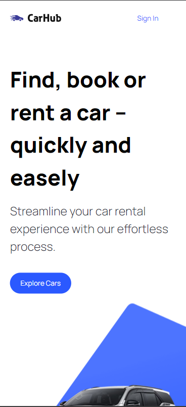
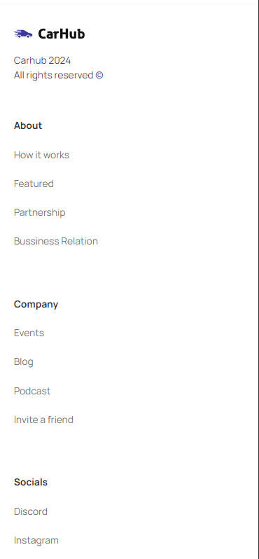

# CarHub 
## Next js 14 + Typescript + Tailwind

### 🏷️ About 

A car rental website prototype.

### 💡 Functionalities 

* Next.js 14 App Router and Server side Rendering.
* API Consumption: RapidAPI - Cars API.
* Advanced Search Functionality.
* Optimize Metadata and SEO.
* Custom filter, combo box, and modal elements.
* Well-organized file and folder structure.
* Clean code
* Responsive

###  🛠️ Built with

* Next 14
* Typescript
* Tailwind
* Git/GitHub

### 🌐 Website
:link: Link to access the website: [https://car-hub-black-one.vercel.app/](https://car-hub-black-one.vercel.app/)

### 📸 Screenshots

### Layout Desktop

***

***

### Layout Mobile
 
***

***

### ✒️ Author
## :raising_hand: Thiago Alves

- Linkedin - [Thiago Alves](https://www.linkedin.com/in/thiago-alves-010915274/)
- GitHub - [Thiago87dev](https://github.com/Thiago87dev)
- Frontend Mentor - [@MrThiago87](https://www.frontendmentor.io/profile/MrThiago87)
- Instagram - [@thiagopaulista87](https://www.instagram.com/thiagopaulista87/)

#### *Note:

This project was made following a YouTube tutorial.

:link: JavaScript Mastery Channel: [https://www.youtube.com/@javascriptmastery](https://www.youtube.com/@javascriptmastery)

:link: video link: [https://www.youtube.com/watch?v=pUNSHPyVryU&list=PLcSWJ6npNXDpa-ZYULa5pSYToSvgjkeLG&index=2](https://www.youtube.com/watch?v=pUNSHPyVryU&list=PLcSWJ6npNXDpa-ZYULa5pSYToSvgjkeLG&index=2)